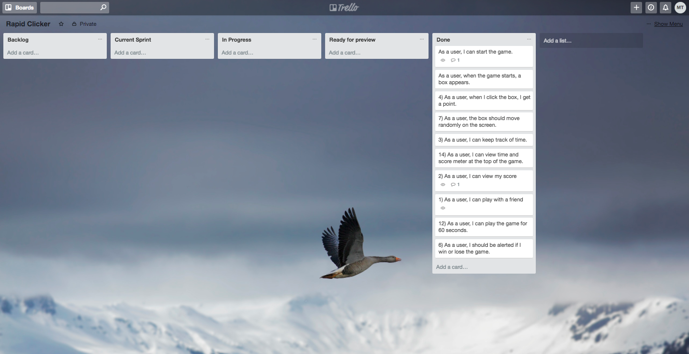

# Rapid Clicker
_
This game is a 2 player game that tests how fast you can click on the clicker. The clicker has been designed to move randomly which makes it more tricky to click.

*** Introduction to Rapid Clicker. ***

  Welcome to Rapid Clicker!

  This game has been designed to test how fast you can click the clicker in 30 seconds.
  It's a 2 player game, so you can challenge your friends!

*** Rapid Clicker Instructions ***
  * Click the start game to start as player 1
  * Player 1 should click the clicker as fast as you can.
  * Player 1 can play for 30 seconds.
  * The game alerts player 2 to start clicking.
  * Player 2 should click the clicker as fast as you can.
  * After 30 seconds, the winner of the game is displayed.

## Task

Build a **browser based game!** The game should be built using html, css and JavaScript!

Game must:
* Include an instruction section explaining how to play the game.
* Ether display a message when the user has won or display the users score after the game has finished.
* Be styled to perfection!
* Be hosted online!

**BONUS**

* Your game could include a leaderboard.
* Your game could be 2 player.
* Your game could be played against the computer...
* You could include some fancy animations in your game...
* You could into HTML5 Audio and include some snazzy sound effects...

**Completed user stories**
  * I built a browser based game using html, css and JavaScript!.

Game includes:
  * Instruction explaining how to play the game.
  * It's a 2 player game
  * Display a message when a player wins.

**Most pleased with**
  * Being able to build a 2 player game.
  * Being able to implement player 1 score and player 1 time together.

**Difficulties**
  * I got the game mechanics done in time but really struggled in implementing a 2 player game.
  * I also find it really difficult to include a timer for both players.

  ***Wireframe***

***Trello***

